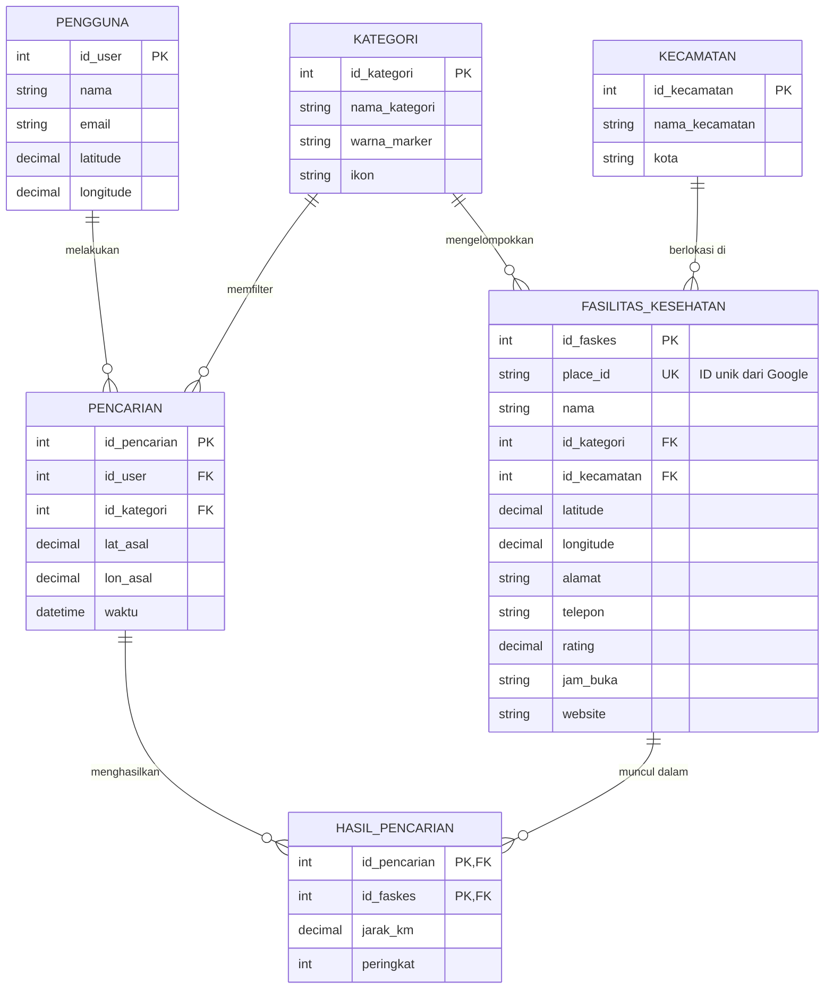
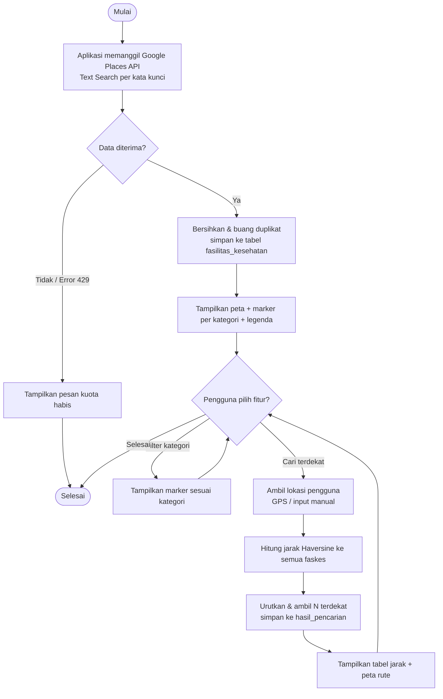
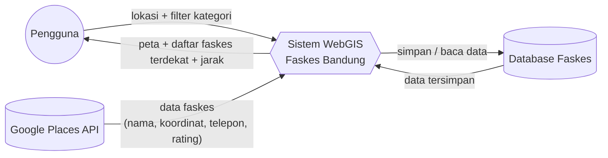

# Perancangan Database & Alur Sistem
## WebGIS Fasilitas Kesehatan Kota Bandung

Dokumen ini berisi: (1) **ERD** (Entity Relationship Diagram), (2) **Skema Tabel**,
(3) **Alur Sistem / Flowchart**, dan (4) **DFD (Data Flow Diagram)**.

> Catatan: aplikasi saat ini mengambil data langsung dari **Google Places API**.
> Rancangan database di bawah adalah **desain bila data disimpan ke basis data sendiri**
> (mis. untuk caching, riwayat pencarian, dan manajemen data offline).

---

## 1. ERD (Entity Relationship Diagram)



### Penjelasan Entitas
| Entitas | Keterangan |
|---|---|
| **KATEGORI** | Jenis faskes: Rumah Sakit, Klinik, Apotek, Dokter Gigi, Dokter. Menyimpan warna marker & ikon untuk peta. |
| **KECAMATAN** | Wilayah administratif tempat faskes berada (untuk analisis sebaran per kecamatan). |
| **FASILITAS_KESEHATAN** | Tabel inti. Tiap baris = 1 faskes (data dari Google Places: nama, koordinat, alamat, telepon, rating, jam buka, website). |
| **PENGGUNA** | Pengguna aplikasi (opsional). Menyimpan lokasi terakhir untuk fitur "faskes terdekat". |
| **PENCARIAN** | Riwayat pencarian "faskes terdekat dari lokasi saya" (titik asal + filter kategori + waktu). |
| **HASIL_PENCARIAN** | Tabel penghubung (junction) M:N antara Pencarian & Faskes. Menyimpan **jarak (km)** dan **peringkat** hasil. |

### Penjelasan Relasi (Kardinalitas)
- **Kategori (1) — (N) Faskes**: satu kategori memiliki banyak faskes; satu faskes hanya satu kategori.
- **Kecamatan (1) — (N) Faskes**: satu kecamatan punya banyak faskes.
- **Pengguna (1) — (N) Pencarian**: satu pengguna bisa melakukan banyak pencarian.
- **Kategori (1) — (N) Pencarian**: satu kategori dapat menjadi filter di banyak pencarian.
- **Pencarian (M) — (N) Faskes** lewat **Hasil_Pencarian**: satu pencarian menghasilkan banyak faskes; satu faskes bisa muncul di banyak pencarian.

---

## 2. Skema Tabel (SQL)

```sql
CREATE TABLE kategori (
    id_kategori   INT PRIMARY KEY AUTO_INCREMENT,
    nama_kategori VARCHAR(50)  NOT NULL,
    warna_marker  VARCHAR(10),
    ikon          VARCHAR(50)
);

CREATE TABLE kecamatan (
    id_kecamatan   INT PRIMARY KEY AUTO_INCREMENT,
    nama_kecamatan VARCHAR(80) NOT NULL,
    kota           VARCHAR(80) DEFAULT 'Kota Bandung'
);

CREATE TABLE fasilitas_kesehatan (
    id_faskes     INT PRIMARY KEY AUTO_INCREMENT,
    place_id      VARCHAR(120) UNIQUE,          -- ID unik dari Google Places
    nama          VARCHAR(150) NOT NULL,
    id_kategori   INT,
    id_kecamatan  INT,
    latitude      DECIMAL(10,7) NOT NULL,
    longitude     DECIMAL(10,7) NOT NULL,
    alamat        VARCHAR(255),
    telepon       VARCHAR(30),
    rating        DECIMAL(2,1),
    jam_buka      TEXT,
    website       VARCHAR(255),
    FOREIGN KEY (id_kategori)  REFERENCES kategori(id_kategori),
    FOREIGN KEY (id_kecamatan) REFERENCES kecamatan(id_kecamatan)
);

CREATE TABLE pengguna (
    id_user   INT PRIMARY KEY AUTO_INCREMENT,
    nama      VARCHAR(100),
    email     VARCHAR(120) UNIQUE,
    latitude  DECIMAL(10,7),
    longitude DECIMAL(10,7)
);

CREATE TABLE pencarian (
    id_pencarian INT PRIMARY KEY AUTO_INCREMENT,
    id_user      INT,
    id_kategori  INT,
    lat_asal     DECIMAL(10,7) NOT NULL,
    lon_asal     DECIMAL(10,7) NOT NULL,
    waktu        DATETIME DEFAULT CURRENT_TIMESTAMP,
    FOREIGN KEY (id_user)     REFERENCES pengguna(id_user),
    FOREIGN KEY (id_kategori) REFERENCES kategori(id_kategori)
);

CREATE TABLE hasil_pencarian (
    id_pencarian INT,
    id_faskes    INT,
    jarak_km     DECIMAL(6,2),
    peringkat    INT,
    PRIMARY KEY (id_pencarian, id_faskes),
    FOREIGN KEY (id_pencarian) REFERENCES pencarian(id_pencarian),
    FOREIGN KEY (id_faskes)    REFERENCES fasilitas_kesehatan(id_faskes)
);
```

---

## 3. Alur Sistem (Flowchart)



---

## 4. DFD (Data Flow Diagram) — Level 0 / Context Diagram



### Penjelasan DFD
- **Pengguna** mengirim **lokasi + filter kategori**, menerima **peta & daftar faskes terdekat**.
- **Google Places API** = sumber data eksternal yang memasok data faskes.
- **Sistem WebGIS** = proses utama (ambil data, hitung jarak, render peta).
- **Database Faskes** = penyimpanan (data faskes, riwayat pencarian).

---

## Ringkasan Istilah
| Istilah | Arti singkat |
|---|---|
| **ERD** | Diagram struktur database: entitas (tabel), atribut (kolom), relasi antar tabel. |
| **Skema Tabel** | Definisi tabel dalam SQL (kolom, tipe data, PK/FK). |
| **Flowchart** | Diagram alur langkah-langkah proses aplikasi. |
| **DFD** | Diagram aliran data antara pengguna, sistem, sumber data, dan penyimpanan. |
| **PK / FK** | Primary Key (kunci utama unik) / Foreign Key (kunci tamu, penghubung antar tabel). |
